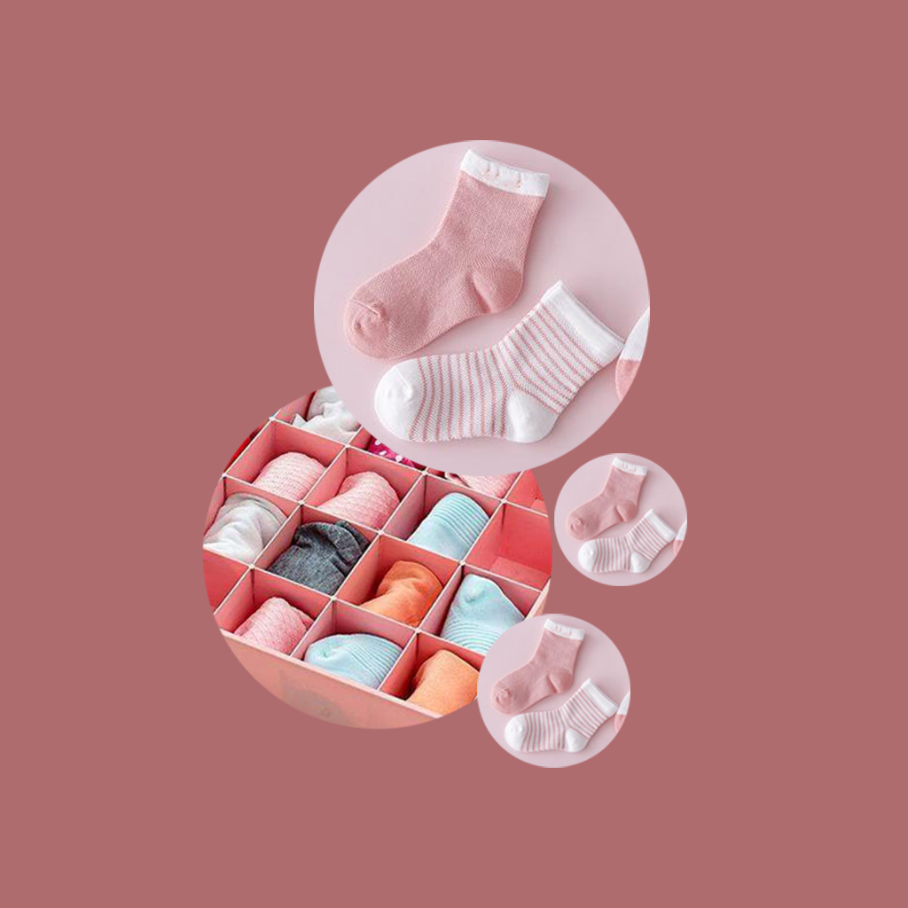

## 欢迎来到 宝宝袜子分类存放记录

在我们日常生活中，我们需要经常给宝宝更换不同类别的袜子。例如早晨天气比较清凉，宝宝需要比较保暖的袜子穿着防止着凉。当宝宝平时活动玩耍时，需要换上透气防滑的袜子。我们可以记录家里宝宝的袜子各种用途的袜子进行分类，袜子的数量，清洗次数，存放位置等信息。这样我们就不会手忙脚乱的到处翻找袜子了，快速的给宝宝穿上合适的袜子，让宝宝健康的成长。

如果您遇到什么需要解答的问题，请发送您的问题到以下邮箱。

我们将第一时间为您解答。

### 邮箱地址: zhanghesongyuan7@126.com

谢谢！
